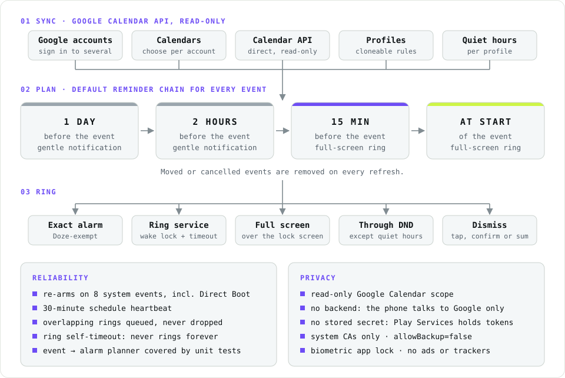

<!-- brand:header:start -->
<h1 align="center">WhiteRings</h1>

  <b>Android app that turns Google Calendar events into full-screen alarms.</b>

  Working and in daily use on Android. Google Play and F-Droid releases are in preparation. Rings through silent mode and Do Not Disturb. No backend, read-only calendar access.

  
  
  
  
  
   
  
  
  
  
   
  
  
  
  
  
  

  

  <picture>
    <source media="(prefers-color-scheme: dark)" srcset="docs/assets/whiterings-architecture-dark.svg">
    
  </picture>

## At a glance

<table>
  <tr><td width="190"><b>What it does</b></td><td>Reads Google calendars and gives every event a chain of reminders: notifications a day and two hours before, then full-screen alarms 15 minutes before and at the start.</td></tr>
  <tr><td width="190"><b>How it works</b></td><td>Events come straight from the Google Calendar API (read-only). A planner expands them into alarms, which are scheduled with Android's alarm-clock API so Doze does not delay them.</td></tr>
  <tr><td width="190"><b>Reliability</b></td><td>Alarms are re-armed after reboots, clock and timezone changes and app updates, and a heartbeat re-checks the schedule every 30 minutes.</td></tr>
  <tr><td width="190"><b>Where it runs</b></td><td>Android 8.0 and later. It is in daily use today, installed from <a href="https://github.com/ricardo-david-francisco/WhiteRings-public/releases/latest">Releases</a>; Google Play and F-Droid listings are in preparation. There is no server.</td></tr>
</table>

<table>
  <tr>
    <td align="center"><b>2,600+</b> lines of Kotlin</td>
    <td align="center"><b>8</b> system events that re-arm alarms</td>
    <td align="center"><b>30 min</b> schedule heartbeat</td>
    <td align="center"><b>0</b> servers</td>
    <td align="center"><b>0</b> ads or trackers</td>
  </tr>
</table>

## Tech stack

| Area | Used for |
|---|---|
| **App** | Kotlin, Jetpack Compose, Material 3, Navigation Compose, coroutines |
| **Scheduling** | <code>AlarmManager.setAlarmClock</code>, foreground ring service with a wake lock, WorkManager, broadcast receivers for boot (including Direct Boot), clock and package events |
| **Data and APIs** | Google Calendar REST API over OkHttp, Google Identity (Credential Manager, Authorization API), DataStore, kotlinx.serialization |
| **Security** | Read-only OAuth scope, biometric app lock, network security config that trusts system CAs only, backups disabled |
| **Build** | Gradle Kotlin DSL with a version catalog, JVM unit tests, GitHub Actions build, GitHub Releases |

---
<!-- brand:header:end -->

## Contents

- [At a glance](#at-a-glance)
- [Tech stack](#tech-stack)
- [Features](#features)
- [Reliability](#reliability)
- [Privacy and security](#privacy-and-security)
- [Install](#install)
- [Status](#status)

---

## Features

- **Multiple Google accounts and calendars**, each assigned to a profile.
- **Profiles**: named, cloneable alarm behaviours covering the reminder chain,
  ring length, rising volume, vibration, flashlight, snooze rules, dismiss mode,
  quiet hours and an optional message on the ring screen.
- **Default reminder chain.** After sign-in every calendar gets the chain shown
  in the diagram; profiles can change it.
- **Rings through silent mode and DND.** Only your own quiet hours can silence
  it, or downgrade it to a gentle notification.
- **Dismiss modes**: a single tap, a confirm tap, or solving a quick sum.
  Snooze with a configurable limit.
- **Biometric app lock**: alarms still fire while the app is locked.

## Reliability

The usual reasons Android alarms fail, and what WhiteRings does about each:

| Failure mode | How WhiteRings handles it |
|---|---|
| Doze and battery optimisation delay alarms | Rings are scheduled with `AlarmManager.setAlarmClock()`, which is exempt from Doze (stronger than the `setExactAndAllowWhileIdle` most alarm apps use) |
| Android's calendar sync is flaky; cancelled events keep ringing | Reads the **Google Calendar API** directly (read-only) and reconciles moved or cancelled events on every refresh |
| Reboots, clock changes and app updates wipe scheduled alarms | Re-arms on 8 system events: boot (including **Direct Boot**, before first unlock), quick boot, time, date and timezone changes, app update and exact-alarm permission change |
| Silent failures nobody notices | A **30-minute self-healing heartbeat** re-verifies the whole schedule |
| Stuck or overlapping rings | A **foreground ring service** with a wake lock and self-timeout; overlapping alarms are queued, never dropped |
| Aggressive OEM battery managers | Guided onboarding deep-links to the exact battery and auto-launch settings (tested on Honor / MagicOS) |

The event → alarm expansion logic is covered by JVM unit tests.

## Privacy and security

- Read-only Google Calendar scope. **No backend**: the phone talks to Google directly.
- No long-lived secret stored by the app; tokens are held by Google Play Services.
- Trusts only system certificate authorities (rejects user-installed MITM certificates).
- `allowBackup=false`. No ads, analytics or trackers.

## Install

1. Download the APK from [Releases](https://github.com/ricardo-david-francisco/WhiteRings-public/releases/latest).
2. Open it on your phone and allow installing from that source when Android asks.
3. Follow the in-app onboarding: notifications, exact alarms, full-screen alarms and battery settings.

Connecting a Google account (about 3 minutes, no server)

WhiteRings has no backend, so Google sign-in uses your own OAuth client.
The same guide is available in the app under **Settings**.

1. In [Google Cloud Console](https://console.cloud.google.com), create a project and enable the **Google Calendar API**.
2. Configure the OAuth consent screen (External) with the scope `.../auth/calendar.readonly`.
3. Set the publishing status to **In production** (in Testing, access expires every 7 days).
4. Create an **Android** OAuth client for package `app.whiterings` with the SHA-1 of the APK's signing certificate.
5. WhiteRings → **Accounts** → **Sign in**, and accept the one-time "unverified app" screen (expected for a private app). It refreshes silently from then on.

## Status

Working and in daily use. v0.1.0 is distributed as an APK from Releases; Google Play and
F-Droid releases are in preparation.
Minimum Android 8.0 (API 26), targets Android 15 (API 35).

<!-- brand:footer:start -->

---

  Maintained by <a href="https://github.com/ricardo-david-francisco">Ricardo David Francisco</a>

<!-- brand:footer:end -->
